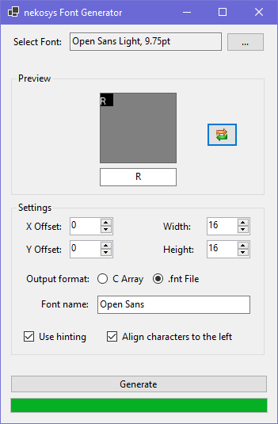

# font-generator
Tool for generating nekosys-compatible fonts

Can generate C-Arrays (for the kernel console) and .fnt files (for graphical userspace)

## Screnshot





## About .fnt files

These files are custom binary bitmap font files with the following format:

### General structure

```
FNT[header][glyphs...][0x0216]
```

The first three and the last two bytes are magic values. The glyphs are ASCII characters 0-255 (in that order).

### Header

```
[CString FontName][uint8 glyphWidth][uint8 glyphHeight]
```

 CString is a null-terminated string.

### Glyph

```
[uint32[] rows...][uint8 glyphWidth]
```

The rows array has a length of `glyphHeight`. Each `uint32` describes a single row in the bitmap for that glyph. It contains a bitmask of which pixels in that row are to be colored in by the font renderer.


